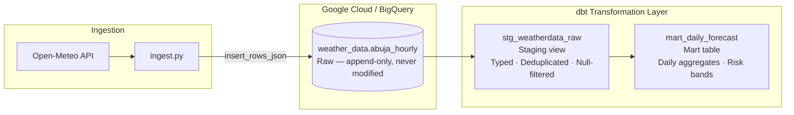
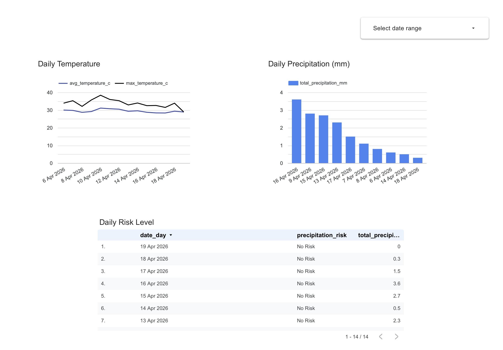

# Abuja Weather Intelligence Pipeline

> **Business problem:** Logistics operators, agricultural planners, and field operations teams in Nigeria make daily decisions affected by weather — but there is no centralized, queryable, historically-accumulating weather store for Nigerian cities. This pipeline creates one, and surfaces a daily operational risk signal on top of it.

---

## What This Project Actually Does

Every hour, this pipeline:

1. Fetches hourly forecast data for Abuja from the Open-Meteo API
2. Streams it into a raw BigQuery table exactly as received
3. Runs dbt transformations that clean, deduplicate, and roll up the data into a mart table
4. Produces a `precipitation_risk` signal per calendar day (`Low`, `Moderate`, or `High Risk`) based on precipitation thresholds — a concrete, business-interpretable output, not just raw numbers

The mart table is designed to answer questions like:

- *How many high-risk weather days has Abuja had this month?*
- *Which days last week were safe for outdoor field operations?*
- *What is the seasonal precipitation pattern across the year?*

---

## Architecture



### Why this architecture?

| Decision | Rationale |
|---|---|
| **Raw table is append-only** | Preserves source truth. If transformation logic changes, the raw data can be reprocessed without re-fetching from the API. This is a foundational production pattern. |
| **Staging as a view, mart as a table** | Staging is cheap to recompute and doesn't need to be stored. The mart is queried by downstream consumers and benefits from materialisation. |
| **BigQuery over Postgres** | This is an analytical workload — columnar storage and serverless scaling make BigQuery the right fit. Postgres would work at this volume but introduces infrastructure management with no benefit. |
| **dbt over raw SQL scripts** | Version-controlled, testable, self-documenting transformations. Every model is a node in a DAG with lineage you can inspect. |
| **Africa/Lagos timezone for daily grain** | Daily rollups bucketed in UTC would misalign with local operational decisions. `DATE(observed_at, 'Africa/Lagos')` ensures the date means what a Nigerian operator would expect it to mean. |

---

## Real-World Challenges Handled

This is not a clean-dataset tutorial. The pipeline was designed with production constraints in mind:

### 1. Duplicate hours from re-runs
The Open-Meteo forecast API returns overlapping windows — re-running ingestion inserts duplicate rows for the same hour. The staging model handles this with a deduplication strategy: for any given `observed_at`, only the latest `ingested_at` row survives. Downstream models always see exactly one row per hour.

```sql
-- Deduplication in stg_weatherdata_raw
qualify row_number() over (
    partition by observed_at
    order by ingested_at desc
) = 1
```

### 2.  Forecast data, not observations
The Open-Meteo API returns **forecast** data, not historical station observations. This distinction matters — forecast values for a past hour may differ from what actually occurred. The mart is named `mart_daily_forecast` deliberately, and this is documented in the data model so any downstream consumer understands what they're querying.

---

## Data Models

### `stg_weatherdata_raw` (view)

Reads from `weather_data.abuja_hourly`. Applies:
- Type casting on all columns
- Null filter on `observed_at`
- Deduplication by `observed_at` (latest ingestion wins)
- Derives `date_day` in Africa/Lagos timezone

### `mart_daily_forecast` (table)

Daily grain. One row per Lagos calendar date.

| Column | Description |
|---|---|
| `date_day` | Calendar date (Africa/Lagos) |
| `avg_temp_c` | Mean hourly temperature |
| `max_temp_c` | Peak temperature |
| `min_temp_c` | Minimum temperature |
| `total_precipitation_mm` | Sum of hourly precipitation |
| `max_windspeed_kmh` | Peak wind speed |
| `precipitation_risk` | `Low Risk` / `Moderate Risk` / `High Risk` |

**Risk logic:**
```sql
CASE
    WHEN SUM(precipitation_mm) > 20 THEN 'High Risk'
    WHEN SUM(precipitation_mm) > 10 THEN 'Moderate Risk'
    WHEN SUM(precipitation_mm) > 5 THEN 'Low Risk'
    ELSE 'No Risk'
END AS precipitation_risk
```

---

## Data Quality

Tests are defined in `models/schema.yml` and enforced with `dbt test`:

| Test | Column | Model |
|---|---|---|
| `not_null` | `observed_at`, `temperature_c`, `precipitation_mm` | Staging |
| `unique` | `observed_at` | Staging |
| `not_null` | `date_day` | Mart |
| `unique` | `date_day` | Mart |
| `accepted_values` | `precipitation_risk` | Mart |
| Source freshness | `ingested_at` on `raw.abuja_hourly` | Source |

Source freshness is configured in `_sources.yml` — `dbt source freshness` will warn if the raw table hasn't received data within a defined window, catching silent ingestion failures before they reach the mart.

---

## Dashboard

**[View Live Dashboard →](https://lookerstudio.google.com/reporting/6f3bb11f-cebe-4525-8c62-0fda56470fc9)**



Connected directly to `mart_daily_forecast` in BigQuery. Three charts, one business question:

- **Daily Temperature** — average and peak temperature per day, showing the thermal envelope
  field operations teams work within
- **Daily Precipitation (mm)** — total rainfall per day; the primary input to the risk classification
- **Daily Risk Level** — the operational output: each calendar day classified and ranked by
  precipitation, filterable by date range

The dashboard is the delivery layer for the pipeline's core output — `precipitation_risk` —
translating a dbt mart model into something a non-technical operator can act on directly.

---

## Tech Stack

| Layer | Tool |
|---|---|
| Data source | [Open-Meteo API](https://open-meteo.com/) (free, no auth required) |
| Ingestion | Python 3.13, `requests`, `google-cloud-bigquery` |
| Warehouse | Google BigQuery |
| Transformation | dbt Core + dbt-bigquery |
| Auth | GCP Service Account (JSON key, never committed) |
| Orchestration | Airflow, hourly |
| BI | Looker Studio |

---

## Getting Started

### Prerequisites

- Google Cloud project with BigQuery enabled
- Service account with `BigQuery Data Editor` on the target dataset
- Service account JSON key (**never commit this**)
- Python 3.11+

### 1. Clone and install

```bash
git clone https://github.com/<your-username>/weatherdataabuja.git
cd weatherdataabuja
python3 -m venv venv
source venv/bin/activate
pip install -r requirements.txt
```

### 2. Set credentials

```bash
export GOOGLE_APPLICATION_CREDENTIALS="/absolute/path/to/your-service-account.json"

# Optional: override the default destination table
export BIGQUERY_TABLE_ID="your-project.your_dataset.abuja_hourly"
```

### 3. Configure dbt profile

Create or update `~/.dbt/profiles.yml`:

```yaml
weather_abuja_pl:
  target: dev
  outputs:
    dev:
      type: bigquery
      method: service-account
      project: your-gcp-project-id
      dataset: weather_data
      location: US
      keyfile: /absolute/path/to/your-service-account.json
      threads: 4
```

Update `database` and `schema` in `models/staging/_sources.yml` to match your project and dataset.

### 4. Run the pipeline

```bash
# Ingest
python ingest.py

# Transform
dbt run

# Test
dbt test

# Check source freshness
dbt source freshness
```

---

## Author

Built as a data engineering and analytics engineering portfolio project.
Covers the full analytical stack: REST ingestion → cloud warehouse → transformation layer → declarative testing → business-interpretable output.
