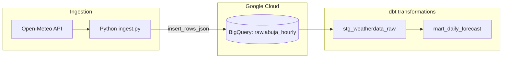

# Abuja Weather Forecast Pipeline

End-to-end **data pipeline** that ingests hourly **weather forecast** data for Abuja, Nigeria (Open-Meteo), loads it into **Google BigQuery**, and transforms it with **dbt** into staging and mart models—with **tests**, **deduplication**, and **Lagos-local** daily aggregations.

This repository is structured as a **portfolio-ready** example of modern analytics engineering: Python ingestion, cloud warehouse, version-controlled SQL, and declarative tests.

---

## Highlights

| Area | What this project shows |
|------|-------------------------|
| **Ingestion** | Python + Open-Meteo API + BigQuery streaming inserts |
| **Warehouse** | BigQuery (project / dataset / table) |
| **Transformations** | dbt: staging view → mart table, `schema.yml` docs & tests |
| **Data quality** | `not_null`, `unique`, `accepted_values`, source **freshness** config |
| **Semantics** | Forecast vs observation called out; **Africa/Lagos** calendar days; duplicate-hour handling |

---

## Architecture



- **Raw**: `weather_data.abuja_hourly` — hourly rows from the forecast API (temperature, precipitation, wind, timestamps).
- **Staging** (`stg_weatherdata_raw`): Typed columns, null-time filter, **one row per `observed_at`** (latest `ingested_at` wins).
- **Mart** (`mart_daily_forecast`): Daily rollups by **Lagos calendar date**, aggregates, and a simple precipitation **risk band** for dashboards or downstream use.

---

## Tech stack

- **Python 3.11+** (3.13 used in development)
- **requests** — HTTP to Open-Meteo
- **google-cloud-bigquery** — load to BigQuery
- **dbt Core** + **dbt-bigquery** — models, tests, documentation in YAML
- **GCP** — BigQuery + service account authentication

---

## Repository layout

```
weatherdataabuja/
├── ingest.py                 # Fetch forecast + stream to BigQuery
├── requirements.txt          # Python + dbt dependencies
├── dbt_project.yml           # dbt project + model materializations
├── models/
│   ├── staging/
│   │   ├── stg_weatherdata_raw.sql
│   │   └── _sources.yml      # raw source + freshness
│   ├── mart/
│   │   └── mart_daily_forecast.sql
│   └── schema.yml            # column docs + generic tests
├── analyses/
│   └── rename_raw_temperature_column.sql   # optional one-time BQ DDL (commented)
└── weather_abuja.csv         # sample export (optional reference)
```

> **Note:** `dbt` reads **`~/.dbt/profiles.yml`** for your BigQuery connection (not committed). The **`target/`** and **`logs/`** directories are gitignored.

---

## Prerequisites

1. **Google Cloud** project with BigQuery enabled  
2. **Service account** with BigQuery Data Editor (or equivalent) on the target dataset  
3. **JSON key** for that account (keep it **out of git**; use env vars)  
4. **Python 3.11+** and optionally a virtual environment  
5. **dbt** profile for BigQuery (see below)

---

## Quick start

### 1. Clone and virtual environment

```bash
git clone https://github.com/<your-username>/<your-repo>.git
cd <your-repo>
python3 -m venv venv
source venv/bin/activate   # Windows: venv\Scripts\activate
pip install -r requirements.txt
```

### 2. Google credentials (ingest)

Do **not** commit key files. Point the SDK at your key file:

```bash
export GOOGLE_APPLICATION_CREDENTIALS="/absolute/path/to/your-service-account.json"
```

Optional: override the default table (defaults to `meteo-ingest.weather_data.abuja_hourly`):

```bash
export BIGQUERY_TABLE_ID="your-project.your_dataset.abuja_hourly"
```

### 3. dbt profile

Create **`~/.dbt/profiles.yml`** (or merge into it) with a target named to match **`profile: weather_abuja_pl`** in `dbt_project.yml`, for example:

```yaml
weather_abuja_pl:
  target: dev
  outputs:
    dev:
      type: bigquery
      method: service-account
      project: your-gcp-project-id
      dataset: weather_data
      location: US   # or your dataset location
      keyfile: /absolute/path/to/your-service-account.json
      threads: 4
```

Adjust **`project`**, **`dataset`**, **`location`**, and **`keyfile`** to match your environment. Align **`models/staging/_sources.yml`** `database` / `schema` with your raw table’s project and dataset.

### 4. Raw table column (temperature)

If the raw table still has the legacy column name `temprature_c`, keep **`legacy_raw_temperature_column: true`** in `dbt_project.yml`. After you rename the column to **`temperature_c`** in BigQuery (see `analyses/rename_raw_temperature_column.sql`), set it to **`false`**.

### 5. Run ingestion

```bash
python ingest.py
```

### 6. Run dbt

```bash
dbt deps          # if you add packages later
dbt run
dbt test
dbt source freshness   # optional: checks loaded_at_field on raw
```

---

## Configuration reference

| Item | Purpose |
|------|---------|
| `GOOGLE_APPLICATION_CREDENTIALS` | Path to GCP service account JSON (ingest + often dbt) |
| `BIGQUERY_TABLE_ID` | Override destination table for `ingest.py` |
| `legacy_raw_temperature_column` (`dbt_project.yml`) | Read legacy `temprature_c` vs `temperature_c` in staging |
| `models/staging/_sources.yml` | BigQuery `database` / `schema` for `source('raw', 'abuja_hourly')` |

---

## Data & modeling notes

- **Forecast data**: Open-Meteo **forecast** API — this is **not** historical station observations. The mart is named **`mart_daily_forecast`** accordingly.
- **Daily grain**: `date_day` uses **`DATE(observed_at, 'Africa/Lagos')`** so daily buckets match **local (Lagos) dates**.
- **Duplicates**: Re-running ingest can insert overlapping hours; staging **deduplicates** by `observed_at`, keeping the latest `ingested_at`.

---

## Tests (dbt)

Defined in **`models/schema.yml`**: `not_null`, `unique` (on `date_day`), `accepted_values` for risk labels, plus **source freshness** on `raw.abuja_hourly` via `ingested_at`.

---

## Roadmap / ideas

- [ ] Orchestration (Airflow, Cloud Composer, or GitHub Actions cron)
- [ ] Historical vs forecast split or archive API
- [ ] Dashboard (Looker Studio, Metabase, or Streamlit)
- [ ] Incremental mart or partition strategy as volume grows

---

## License

This project is provided as **portfolio sample code**. Use and modify freely; add a license file (e.g. MIT) if you want standard open-source terms.

---

## Author

Built as a **data engineering / analytics engineering** portfolio piece: ingestion → BigQuery → dbt → tested, documented marts.

If you use this template, replace the clone URL in **Quick start** with your real GitHub repository path after you push.

---

## Publishing to GitHub

From the project root (after `git init` and your first commit):

1. Create a **new empty repository** on GitHub (**no** README, license, or `.gitignore` if you want to avoid merge conflicts).
2. Add the remote and push:

```bash
git remote add origin https://github.com/YOUR_USERNAME/YOUR_REPO_NAME.git
git branch -M main
git push -u origin main
```

Use the SSH form if you prefer: `git@github.com:YOUR_USERNAME/YOUR_REPO_NAME.git`

3. Edit this README and set the clone URL in **Quick start** to your public URL.
